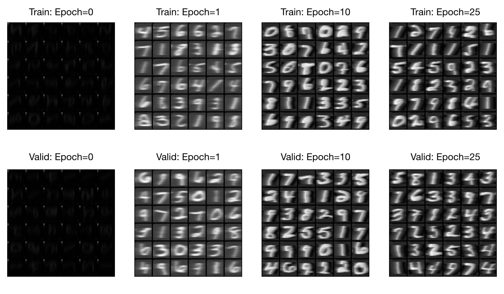

# LSTM-Autoencoder

Reference paper:
*Unsupervised Learning of Video Representations using LSTMs.* [[arxiv](https://arxiv.org/pdf/1502.04681.pdf)]

## Dependencies
* python==3.6
* torchvision==0.2.0
* matplotlib==2.2.2
* scipy==1.0.1
* numpy==1.14.2
* torch==0.3.0

## Examples
### MNIST example
```
python mnist_example.py
```


